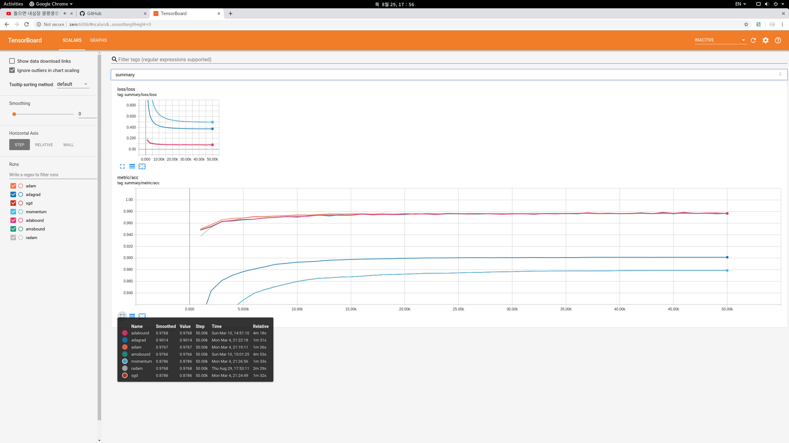

# RAdam in Tensorflow
On The Variance Of The Adaptive Learning Rate And Beyond in Tensorflow

This repo is based on pytorch impl [repo](https://github.com/LiyuanLucasLiu/RAdam)

[](https://lgtm.com/projects/g/kozistr/RAdam-tensorflow/alerts/)
[](https://lgtm.com/projects/g/kozistr/RAdam-tensorflow/context:python)

# Explanation
The learning rate warmup for Adam is a must-have trick for stable training in certain situations (or eps tuning). But the underlying mechanism is largely unknown. In our study, we suggest one fundamental cause is **the large variance of the adaptive learning rates**, and provide both theoretical and empirical support evidence.

In addition to explaining **why we should use warmup**, we also propose **RAdam**, a theoretically sound variant of Adam.

# Requirement
* Python 3.x
* Tensorflow 1.x (maybe 2.x)

## Usage

```python
# learning can be either a scalar or a tensor

# use exclude_from_weight_decay feature, 
# if you wanna selectively disable updating weight-decayed weights

optimizer = RAdamOptimizer(
    learning_rate=0.001,
    beta1=0.9,
    beta2=0.999,
    epsilon=1e-6,
    decay=0.,
    warmup_proportion= 0.1,
    weight_decay=0.,
    exclude_from_weight_decay=['...'],
    amsgrad=False,
)
```

You can simply test the optimizers on MNIST Dataset w/ below model!

For `RAdam` optimizer,
```python
python3 mnist_test --optimizer "radam"
```

## To Do
* impl warmup stage

## Results

Testing Accuracy & Loss among the optimizers on the several data sets w/ under same condition.

### MNIST DataSet



*Optimizer* | *Test Acc* | *Time* | *Etc* |
:---: | :---: | :---: | :---: |
RAdam | **97.80%** | 2m 9s | |
Adam | 97.68% | 1m 45s |  |
AdaGrad | 90.14% | **1m 38s** |  |
SGD | 87.86% | 1m 39s | |
Momentum | 87.86% | 1m 39s | w/ nestrov |

% tested on GTX 1060 6GB

# Citation

```
@article{liu2019radam,
  title={On the Variance of the Adaptive Learning Rate and Beyond},
  author={Liu, Liyuan and Jiang, Haoming and He, Pengcheng and Chen, Weizhu and Liu, Xiaodong and Gao, Jianfeng and Han, Jiawei},
  journal={arXiv preprint arXiv:1908.03265},
  year={2019}
}
```

# Author

Hyeongchan Kim / [kozistr](http://kozistr.tech)